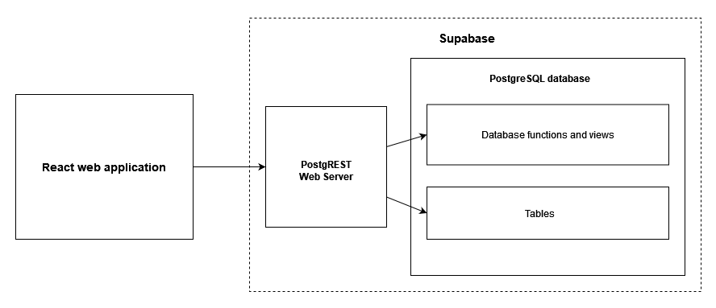

## Architecture

This project consists of two major elements: a database schema and API provided by [Supabase](https://supabase.com/) and built on top of a [PostgreSQL](https://www.postgresql.org/) database and [PostgREST server](https://postgrest.org/en/stable/) and a web application built with [React](https://react.dev/).

(this diagram was created and can be edited with [draw.io](https://app.diagrams.net/) - the xml version is [here](arch.drawio))

Authentication is handled by Supabase and is ready for integration with e.g. Azure AD. The data is secured using PostgreSQL [row level security policies](https://www.postgresql.org/docs/current/ddl-rowsecurity.html). The database migrations are handled using Flyway, they are accessible [here](/migrations).