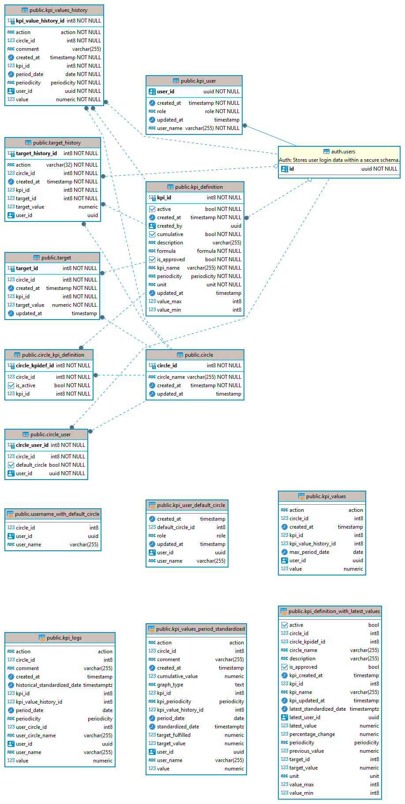

## Database schema

The table containing the KPI values is `public.kpi_values_history`. It is actually a historical log of changes made to a
particular KPI and the latest (currently valid) values can be retrieved using
the `public.kpi_definitions_with_latest_values` view.

## Manual KPI and user management

Adding new KPI definition requires adding a new entry in `public.kpi_definition` table. KPI definitions can be used by
multiple circles, thus allowing a particular circle to start recording values for this KPI requires inserting a record
to `public.circle_kpi_definition`. End users can also propose new KPIs from the UI - doing so will create the required entries but in
order to be usable from the UI they need the flag `public.kpi_definition.is_approved` to be set to true.

Onboarding a new user requires creating his account in the Supabase dashboard and creating an entry in `public.kpi_user` that references the newly created row in `auth.users`. Assigning a user to a circle is done by adding a row in `public.circle_user`.

## Tables

### 1. `kpi_user`
Stores user information in relation to KPIs.
​
### 2. `circle`
Represents groups or teams within the organisation.
​
### 3. `circle_kpi_definition`
Maps circles to KPI definitions.
​
### 4. `circle_user`
Associates users with circles.
​
### 5. `kpi_definition`
Stores definitions of KPIs.
​
### 6. `kpi_values_history`
Stores historical KPI values.
​
### 7. `target`
Sets target values for KPIs.
​
### 8. `target_history`
Logs historical actions on targets.
​
## Triggers

### 1. kpi_def_updated_at
Update timestamp in `updated_at` column automatically in table kpi_definition.

### 2. circle_updated_at
Update timestamp in `updated_at` column automatically in table circle.

### 3. user_updated_at
Update timestamp in `updated_at` column automatically in table kpi_user.

### 4. target_updated_at
Update timestamp in `updated_at` column automatically in table target.

### 5. trigger_check_kpi_values
Check if the value entered in table kpi_values_history is valid in corresponds with the defined unit.
- if unit is boolean: value has to be 0 or 1
- if unit is percentage (%): value has to be >= 0
- if unit is numeric: value has to be >= 0

### 6. trigger_default_circle_count
Check if a user has set a default circle. A user is only allowed one default circle.

### 7. target_history_trigger
The `action` column in target_history is automatically set depending on the action (insert/ update/ delete) that is performed.